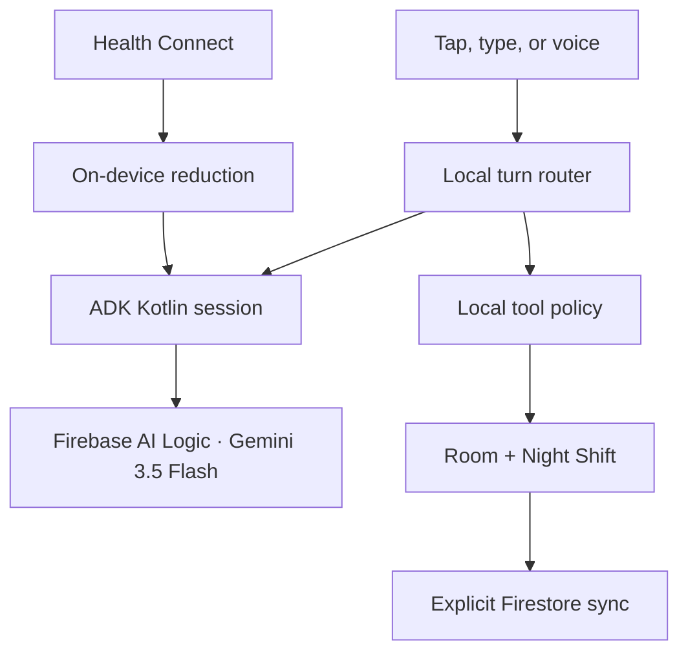

# Wisteria

> A 3-second check-in for days when a full sentence is too much.

[](https://github.com/TONZHub/Wisteria/actions/workflows/android-ci.yml)

Wisteria is a local-first Android prototype that turns a number, emoji, or everyday word into a gentle daily record. It uses four intentionally plain textures—**bright, steady, heavy, and off**—and never assigns a body phase or explains why someone feels a certain way.

## 60-second judge demo

1. Open **Check-In**, tap the microphone, and say “I feel off.” Wisteria captions the turn, saves one check-in, and speaks its reply. The reply shows both the **Google ADK Kotlin** runtime receipt and the separate local-write receipt.
2. Tap **Call**, say “yes, give me one idea,” and confirm the follow-up stays conversational instead of creating another check-in. Toggle hands-free off and back on, then end the call.
3. Open **Insights** to see today's texture and toggle one optional idea as done.
4. Tap the info icon, choose **See How It Works**, then tap **Load 10 clearly labeled demo days**.
5. Wisteria runs Night Shift on-device and shows the heavy-to-off pattern it found, the number of samples used, and a trace of each step.
6. If Firebase is configured, sign in with Google and explicitly tap **Sync Firestore**.

The demo-data button is explicit: every sample starts with `Demo:`, stays local, and is never synced automatically.

## What works today

- One-tap or one-word check-ins with a deterministic local fallback.
- Tap-to-speak check-ins with live partial captions and a spoken Wisteria response.
- Full-screen in-app calls with push-to-talk, turn-based hands-free mode, mute, speaker, captions, and hang up controls.
- A user-scheduled daily Check-In Alarm with exact timing, lock-screen display, snooze, dismiss, reboot recovery, and notification-only fallback when special access is declined.
- A local session router that separates check-ins, follow-ups, idea requests, pattern questions, reminder requests, and conversation endings before any tool can run.
- Duplicate-turn protection and visible receipts for local writes.
- Local Room storage; Android backup is disabled for the app.
- Everyday textures kept separate: bright, steady, heavy, off, or unlabeled.
- User-triggered Night Shift learning from real heavy-to-off stretches in local history—no fixed schedule.
- Sample-based confidence that grows only with saved history and observed transitions.
- Stateful, in-memory companion sessions through [Google ADK Kotlin 0.8.0](https://github.com/google/adk-kotlin).
- Optional ADK companion wording through Firebase AI Logic and `gemini-3.5-flash`, with a visible per-turn runtime receipt.
- Optional, button-triggered Firestore sync under the signed-in Google account's Firebase user ID.
- Firebase App Check: debug provider for debug builds and Play Integrity for release builds.
- Granular Health Connect access for sleep, steps, and optional period timing; raw records and inferred labels never enter the model prompt.
- A test-gated GitHub Actions build that publishes the debug APK and unit-test report.

## Honest boundaries

Wisteria does **not** assign a body phase, label a condition, identify a cause, let the agent change alerts or tasks, place telephone calls, contact anyone, run overnight, or deploy a Cloud Run worker. “Call” means a full-screen conversation inside the Android app. A Check-In Alarm is created only when the person explicitly chooses a time in Insights, and it remains dismissible and independently disableable.

Google ADK Kotlin is used for the optional Firebase-backed dialogue runtime and its in-memory multi-turn session. It does not own texture selection or write authority. Night Shift runs only when the person taps its button. A local tool policy owns storage and care ideas, so an ADK/model response cannot silently authorize a write. Hands-free voice mode uses bounded listen–think–speak turns rather than an always-open microphone. ADK Kotlin is currently a pre-GA dependency; the deterministic local companion remains available if it or Firebase is unavailable.

## Architecture

| Part | Current implementation |
| --- | --- |
| UI | Jetpack Compose |
| Daily record | Room, on-device |
| Turn routing | Deterministic, session-aware Kotlin router before model wording or tools |
| Tool policy | Local allowlist; only explicit check-ins may write a daily record |
| Texture selection | Deterministic Kotlin rules using the submitted number or words |
| Pattern learning | `NightShiftAnalyzer`, on-device and user-triggered |
| Agent framework | Google ADK Kotlin 0.8.0 with an in-memory session reset at conversation boundaries |
| Companion wording | ADK `LlmAgent` → Firebase AI Logic (`gemini-3.5-flash`), with local fallback |
| Voice input | Android `SpeechRecognizer`; on-device recognition is preferred when available |
| Voice output | Android device text-to-speech with utterance lifecycle callbacks |
| Call mode | Full-screen, turn-based in-app voice session over the existing agent loop |
| Private health context | Health Connect records reduced on-device to a tone-only hint; partial permission grants are supported |
| Optional sync | Cloud Firestore at `users/{uid}/daily_timeline/{date}` |
| Identity | Firebase Authentication with Google Sign-In; the resolved UID is used after sign-in |
| Request protection | Firebase App Check |



## Run locally

### Local-only demo

The app targets Android 8.0 (API 26) or newer. It builds and its core demo works without Firebase configuration:

```bash
./gradlew testDebugUnitTest assembleDebug
```

Install `app/build/outputs/apk/debug/app-debug.apk`, then use **Load 10 clearly labeled demo days** for the full judge flow. The first microphone or call action requests `RECORD_AUDIO`; voice features also require an Android speech-recognition service and text-to-speech engine.

To test the Check-In Alarm, open **Insights**, choose a time, and finish the three clearly labeled access steps. Android 12+ asks separately for precise alarm timing; Android 14+ may also ask for full-screen alarm display. If either access is declined, Wisteria preserves an inexact or heads-up notification fallback rather than trapping the person in setup.

### Connected Firebase demo

1. Create a Firebase Android app with package name `com.zoeb.wisteria`.
2. Place the downloaded configuration at `app/google-services.json` (it is gitignored).
3. Enable Google as a Firebase Authentication sign-in provider, Cloud Firestore, and Firebase AI Logic with the Agent Platform backend.
4. Add the app's SHA-1 in Firebase project settings and confirm the Credential Manager `serverClientId` matches the project's Web OAuth client ID.
5. Deploy the included `firestore.rules`.
6. Register the App Check debug token printed by a debug build. Configure Play Integrity for release builds.
7. Sign in with Google, then explicitly tap **Sync Firestore** when you want to copy the current entry.

No developer Gemini API key belongs in this Android project or APK.

For connected GitHub Actions artifacts, add the repository secret `GOOGLE_SERVICES_JSON_B64` containing a base64-encoded `google-services.json`. Public CI still builds safely without the secret and uses the local companion response.

## Verification

Every pull request runs:

```bash
./gradlew testDebugUnitTest assembleDebug --stacktrace
```

The tests cover everyday-language selection, intent routing, ADK runtime receipts and session rotation, multi-turn follow-ups, duplicate transcript blocking, read-only reminder and pattern questions, persistent alarm settings and daily trigger calculation, the alarm's start/snooze/dismiss exits, optional care ideas, private Health Connect context redaction, prompt de-duplication, local-only check-ins, explicit Firestore sync, demo-data labeling, heavy-to-off learning, confidence limits, on-device Night Shift execution, and voice-session UI state.

## Privacy notes

- Check-ins start on-device and are not cloud-synced during a normal check-in.
- Health Connect permissions are independently optional. Wisteria reads only granted signals and reduces them on-device to a generic response-tone hint; raw values, dates, and inferred labels are not sent to Firebase AI Logic or stored by Wisteria.
- Wisteria does not retain raw microphone audio. The configured Android speech service produces a transcript, which passes through the same local intent router as typed text; conversational follow-ups are not saved as new check-ins.
- Voice mode stops recognition while the agent reasons or speaks; hands-free mode opens a new finite listening turn only after speech playback ends.
- Alarm notifications contain only the generic phrase “Your 3-second check-in is ready”; no saved check-in or Health Connect data appears on the lock screen.
- ADK conversation events stay in memory only and become inaccessible when Wisteria starts or ends a conversation; they are not written to Room or Firestore.
- Firestore sync requires an explicit button tap.
- App data is excluded from Android backup.
- The repository contains no Firebase configuration, developer API key, or personal planning artifact in its current tree.

The public Git history predates this cleanup. Maintainers should review and rewrite that history separately before sharing the repository more broadly; history rewriting is intentionally not performed by this feature branch.

## Before final submission

- Record an unedited demo of no more than four minutes using the judge flow above, including the ADK receipt and Google Cloud proof.
- Add two real app screenshots from the connected demo build.
- Configure `GOOGLE_SERVICES_JSON_B64` and register the App Check debug token for the downloadable connected APK.
- Choose and add a project license.
